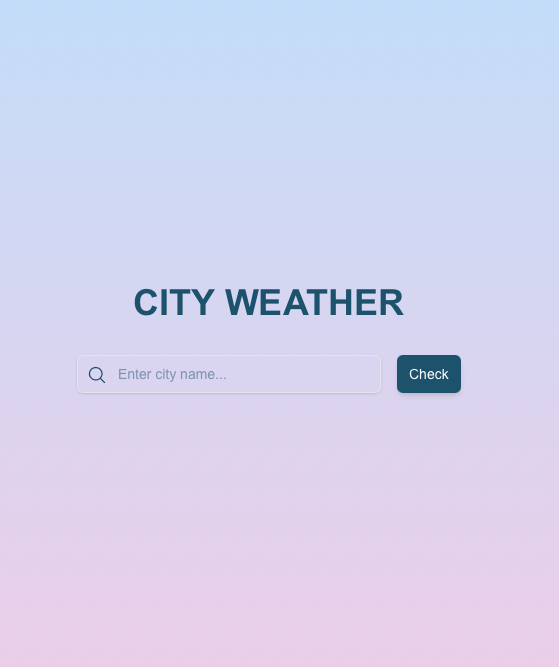
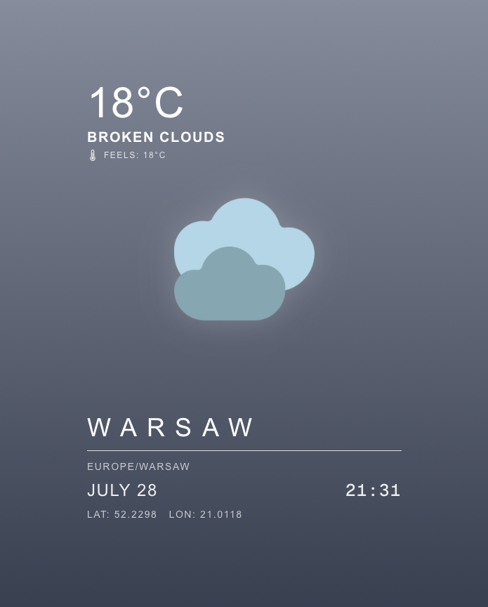
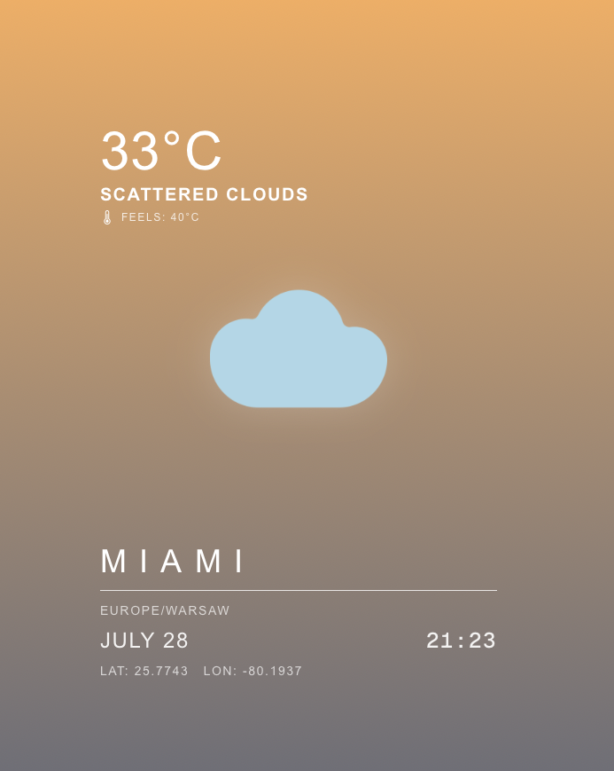
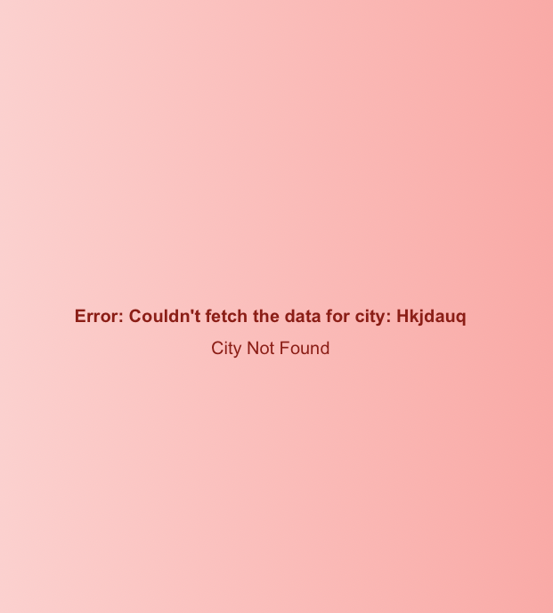

# CityWeather

CityWeather is a simple weather application built with **Next.js** and **TypeScript**. It allows users to check current weather conditions and local time for any city in the world using external APIs.

## Features

- Search for real-time weather by city name
- Dynamic background and weather icons based on current conditions
- Displays temperature, short weather description, feels-like value and coordinates
- Retrieves current local time based on city’s location
- Built-in retry mechanism for unstable time API calls

## Technologies Used

- **Next.js 13+ (App Router) with React components**
- **TypeScript for type safety and maintainability**
- **Tailwind CSS for responsive styling**
- **OpenWeatherMap API for fetching real-time weather data like temperature and conditions**
- **timeapi.io for fetching real-time city information like timezone and local time**

## CICD

CityWeather uses a CI/CD pipeline to ensure reliable deployments and maintain code health. The pipeline includes the following steps:
- Code Quality & Linting  
  - ESLint runs to check for code style and errors.  
  - TypeScript type checks ensure type safety.
- Unit & Integration Tests
  - Jest runs unit tests for components, hooks, and utility functions.
  - Test coverage is collected and saved as an artifact for review.
- End-to-End Tests
  - Cypress runs e2e tests simulating user interactions (searching cities, viewing weather details, error handling).
- Build & Packaging
  - Application is built using Next.js.
  - On the main branch, successful builds are packaged into Docker images and pushed to DockerHub.
- Deployment
  - Automatic deployment to Vercel ensures the live app stays up-to-date.

## Testing
### Jest
- Test coverage is ~97%, covering statements, functions, branches, and lines to ensure robust verification of app functionality.
- Reports are generated in HTML and saved in CI artifacts for inspection.
### Cypress
- End-to-end tests simulate real user flows:
  - Searching for a city
  - Viewing weather details
  - Handling API errors gracefully
- Coverage of critical workflows complements unit testing.

## Skills Demonstrated

- Working with external REST APIs
- Developing a full-stack web application using Next.js App Router and dynamic routing
- Building UI with responsive design using Tailwind CSS

## UX Principles Applied

The design of CityWeather incorporates few key UX principles to create an intuitive and user-friendly experience:

- **Aesthetic-Usability Effect**  
Visually pleasing UI with soft gradients and clean typography improves perceived usability.

- **Law of Proximity**  
Related weather data is grouped closely together, making it easier to scan and understand.

- **Mental Model & Jakob’s Law**  
The interface follows user expectations based on other weather apps, minimizing the learning curve.

- **Cognitive Load Reduction**  
Simple layout, limited options, and large icons make it easy to interact with the content.

## API Key

To run this project, you need an API key from [OpenWeatherMap](https://openweathermap.org/api).

1. Create a `.env.local` file in the root directory.
2. Add the following line:

```bash
OPENWEATHER_API_KEY=api_key
```

## Installation & Run

git clone https://github.com/WiktoriaKalisz/CityWeather.git
cd CityWeather
npm install
npm run dev

Then go to http://localhost:3000 in your browser.

> ⚠️ Note: Sometimes data may not load due to temporary server issues on OpenWeatherMap or timeapi.io. If this happens, try refreshing the page or wait a few moments before retrying.
# API Changes

As of February 2026, CityWeather uses [timeapi.io](https://timeapi.io/) instead of the now-closed WorldTimeAPI for fetching timezone and local time data. The app now calls:

```
https://timeapi.io/api/v1/time/current/coordinate?latitude={lat}&longitude={lon}
```

to get the current time and timezone for a given city.

## Skills Demonstrated

- Working with external REST APIs
- Developing full-stack website with Next.js App Router and dynamic routing
- Building UI with responsive design using Tailwind CSS

Preview






