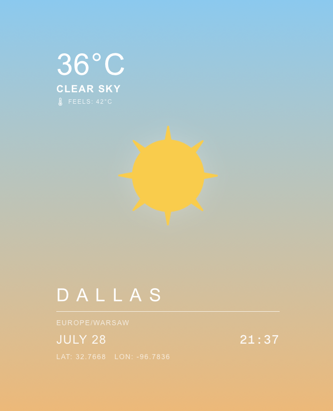

# CityWeather

CityWeather is a simple weather application built with **Next.js** and **TypeScript**. It allows users to check current weather conditions and local time for any city in the world using external APIs.

## Features

- Search for real-time weather by city name
- Dynamic background and weather icons based on current conditions
- Displays temperature, short weather description, feels-like value and coordinates
- Retrieves current local time based on city’s location
- Built-in retry mechanism for unstable time API calls

## Technologies Used

- **Next.js 15**
- **TypeScript**
- **Tailwind CSS**
- **OpenWeatherMap API**
- **WorldTimeAPI**

## API Key

To run this project, you need an API key from [OpenWeatherMap](https://openweathermap.org/api).

1. Create a `.env.local` file in the root directory.
2. Add the following line:

```bash
OPENWEATHER_API_KEY=your_api_key_here

Installation & Run

git clone https://github.com/WiktoriaKalisz/CityWeather.git
cd CityWeather
npm install
npm run dev

Then go to http://localhost:3000 in your browser.

## Skills Demonstrated

- Working with external REST APIs
- Developing full-stack website with Next.js App Router and dynamic routing
- Building UI with responsive design using Tailwind CSS

📸 Preview




